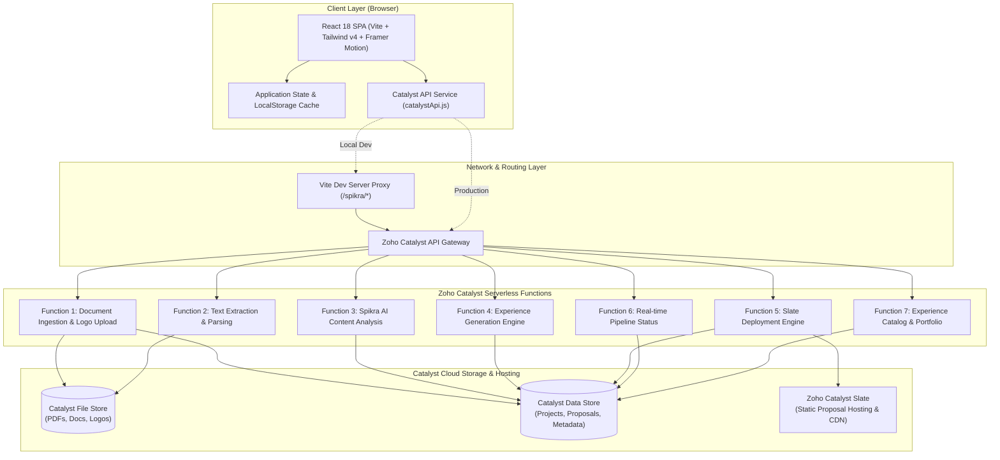
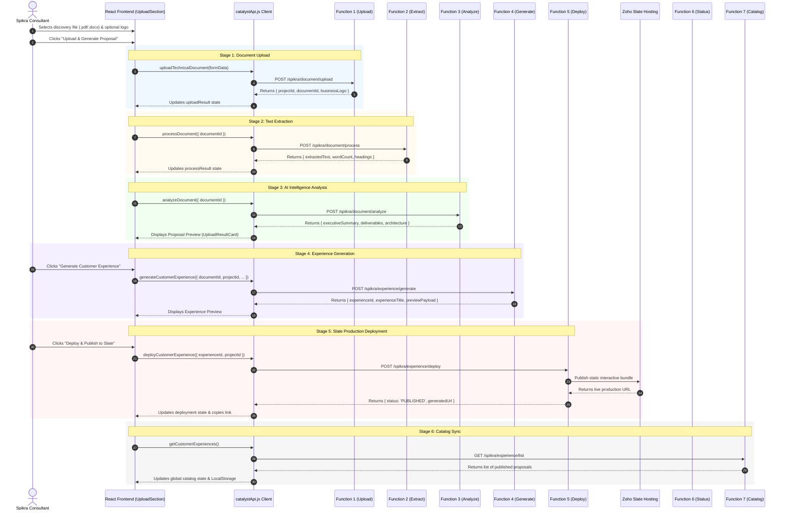

# Spikra AI Proposal — System Architecture & Data Flow

This document details the end-to-end architecture, technical design, data flows, and component interaction models of the **Spikra AI Proposal & Customer Experience Platform**.

---

## 1. High-Level Architecture Overview

Spikra is designed as a modern, decoupled single-page application (SPA) backed by a serverless microservices architecture powered by **Zoho Catalyst**.



---

## 2. End-to-End Proposal Generation Lifecycle

The application operates as a sequential pipeline coordinated between the frontend state machine and serverless backend functions:



---

## 3. Serverless Functions Specification

| Function | Route | Method | Payload / Input | Key Outputs | Purpose |
| :--- | :--- | :---: | :--- | :--- | :--- |
| **Function 1** | `/spikra/document/upload` | `POST` | `multipart/form-data`<br>`business_name`, `project_name`, `document` (File), `business_logo` (File) | `document_id`, `project_id`, `job_id`, `business_logo` metadata | Ingests raw document and client logo into Catalyst File Store. |
| **Function 2** | `/spikra/document/process` | `POST` | `JSON`<br>`{ document_id }` | `processing_status`, `extracted_text`, `char_count`, `word_count` | Serverless text extraction and tokenization from PDF/Word documents. |
| **Function 3** | `/spikra/document/analyze` | `POST` | `JSON`<br>`{ document_id }` | `executive_summary`, `requirements`, `scope`, `deliverables`, `timeline` | LLM reasoning engine synthesizing discovery notes into business requirements. |
| **Function 4** | `/spikra/experience/generate`| `POST` | `JSON`<br>`{ document_id, project_id, ... }` | `experience_id`, `experience_title`, `branding_tokens`, `interactive_slides` | Constructs customized interactive web proposal structures and themes. |
| **Function 5** | `/spikra/experience/deploy` | `POST` | `JSON`<br>`{ experience_id, project_id }` | `status: 'PUBLISHED'`, `generated_url`, `published_time` | Deploys static assets to Catalyst Slate CDN with live public URLs. |
| **Function 6** | `/spikra/process/status` | `GET` | Query param: `?project_id=...` or `?job_id=...` | `stage`, `progress_percent`, `step_number`, `status` | Real-time monitoring of asynchronous pipeline tasks. |
| **Function 7** | `/spikra/experience/list` | `GET` | Query params: `?status=...&limit=...` | `experiences: [...]`, `total_count` | Retrieves historical and active client proposals for the catalog view. |

---

## 4. Frontend Architecture & Component Hierarchy

The frontend is structured into modular layers following Single Responsibility and Container/Presenter patterns:

```text
src/
├── App.jsx                       # Top-Level Router, User Context & Catalog Sync
│   ├── components/Header/        # Global Branding, Navigation & User Badge
│   ├── pages/Dashboard/          # Primary Proposal Creation Workspace
│   │   ├── components/HeroSection/      # Value Proposition & Title
│   │   ├── components/QuickStats/       # Metric Cards (Total, Published, In-Flight)
│   │   └── components/UploadSection/    # Pipeline Orchestrator State Machine
│   │       ├── UploadDropzone/          # Drag-and-drop file & logo selection
│   │       ├── FilePreview/             # File metadata & removal controls
│   │       ├── ProcessingState/         # Animated thinking & stage transitions
│   │       ├── UploadResultCard/        # Proposal review, scope cards & deploy action
│   │       └── ProcessStatus/           # Live 6-stage pipeline progress indicator
│   ├── pages/AllExperiences/     # Catalog Page
│   │   ├── SpikraExperienceSearch/     # Real-time search bar with BorderBeam
│   │   ├── Filter & Sort Toolbar/       # Status filter pills (All, Published, Draft)
│   │   └── Experience Grid Cards/       # Interactive cards with direct URL links
│   └── components/Footer/        # Enterprise footer & links
```

### State Management Strategy
- **Local Pipeline State**: Managed within `UploadSection.jsx` as an explicit finite state machine (`READY` -> `UPLOADING` -> `EXTRACTING` -> `AI_ANALYZING` -> `GENERATED` -> `DEPLOYING` -> `PUBLISHED` -> `FAILED`).
- **Global Portfolio State**: Maintained at `App.jsx` level, shared between `Dashboard` and `AllExperiences`.
- **Offline Resilience & Optimistic Updates**: Proposal entries are immediately updated in React state and synchronized to browser `localStorage` (`spikra_experiences`) while Function 7 verifies backend consistency.

---

## 5. Security & Network Architecture

### 1. Dev Proxy & CORS Elimination
- In local development, the browser makes requests to `/spikra/*`.
- Vite's built-in development proxy forwards these calls to the configured Zoho Catalyst Gateway URL (`https://spikra-ai-proposal-698386704.development.catalystserverless.com`).
- This eliminates CORS preflight delays and `Access-Control-Allow-Origin` failures in developer workstations.

### 2. Secrets & Environment Isolation
- All API endpoint configurations are managed via `.env` and accessed through `import.meta.env.*`.
- The `.gitignore` file strictly prohibits staging `.env` or any environment file variants, preventing accidental credential exposure.
- Safe defaults and configuration documentation are maintained in `.env.example`.

### 3. Client-Side Input Sanitization
- Documents are checked before upload for file size (capped at 99 MB) and authorized MIME types (`application/pdf`, `.docx`).
- Business logos are validated for size (capped at 5 MB) and standard web image formats (`PNG`, `JPEG`, `SVG`, `WebP`).
- Error handlers sanitize stack traces and strip authorization headers or tokens before logging to the browser console.
